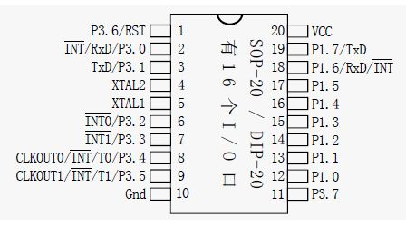
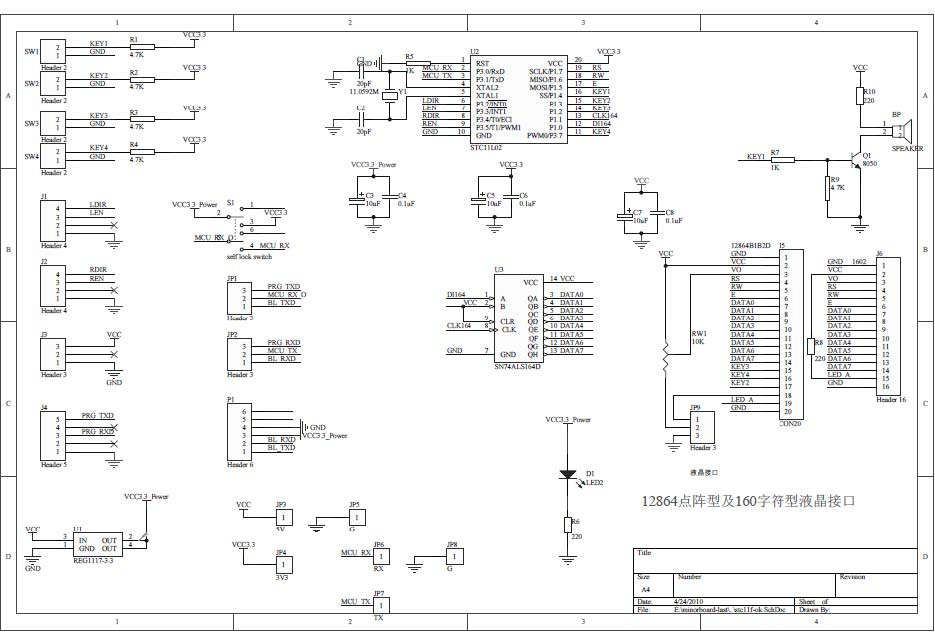
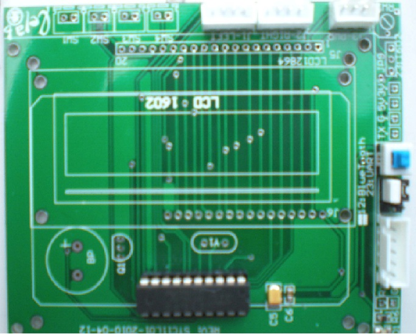
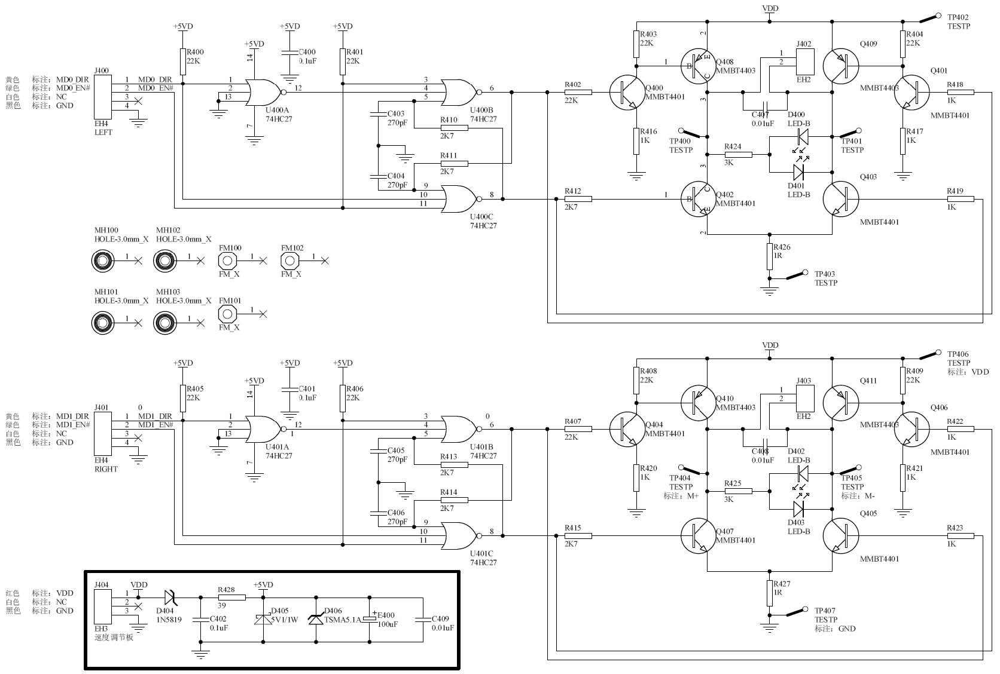
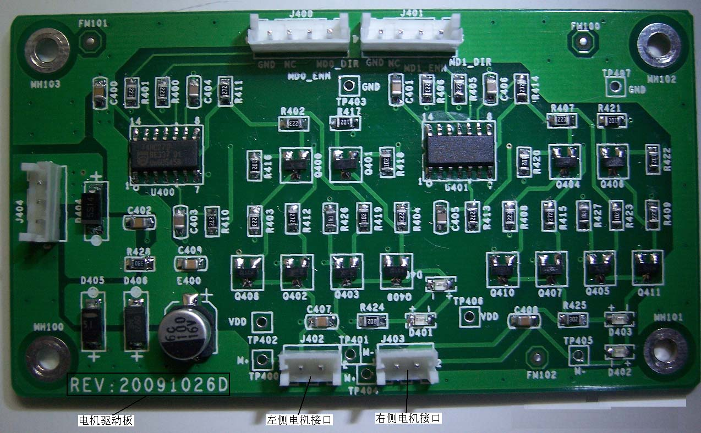

# 基于iOS平台蓝牙通信的小车控制

## 摘要
本项目通过改造遥控小车的控制电路与单片机程序，配合开发iOS平台上的控制程序，实现了在iOS平台上利用蓝牙技术遥控小车。
### 关键字: 单片机 串口通讯 iOS应用程序 iOS蓝牙技术 BTStack

## 项目总览
### 背景

智能手机近两年以不可思议的速度在消费电子市场攻城略地，亲民的价格与强大功能无疑是这股趋势的发动机。当这块屏幕渐渐成为大多数人了解世界的第三只眼睛，以及与世界交互的窗口时，我们站在技术的荒原上，理应对于科技有更高的执念。亦即探索科技的边界，探索工具最多能实现怎样不可思议的任务。

科技创新实践课在我的本科求学生涯中一直扮演一个非常重要的角色。在我大一懵懂无知的时候，这门课程就用一辆支离破碎的小车拖着我的小手，闯入了光怪陆离的电子信息世界。  

本项目再一次给我们提供了一个绝好的机会，从实践的角度去探索手机可以实现怎样的任务，去理解一些耳熟能详，却又不那么清晰的技术。比如单片机，比如蓝牙，比如串口通信，比如移动开发。本项目的完成，也为我们继续研究短距离无线通信的应用打下了基础。

### 项目任务
1. 改造遥控小车，使之能够接收iOS移动设备通过蓝牙技术传过来的控制信号，并根据控制信号作出相应的移动。
2. 在iOS移动设备上开发一个直观易用的遥控应用。

## 设计思路
### 遥控小车改装
遥控小车的改装主要有三种思路：  

1. 自制小车的机械结构和控制、逻辑、通讯、供电电路。
2. 保留遥控小车的机械结构，改造其逻辑和通讯电路。
3. 保留遥控小车的全部元件，改造其遥控器。

从思路1到思路3难度是逐渐降低的，但思路2和思路3实现难度的区别不大，甚至更加直接。综合考虑之后，我们选择思路2。

### iOS控制程序
为了充分发掘和展示移动设备在人机交互方面无与伦比的直观性，我们从触屏，陀螺仪，多点触控等角度对iOS控制程序作出了如下几种设计：

1. 虚拟按键。也就是少年们比较熟悉的手柄（d-pad或joypad），只不过方向按键变成了触屏上的按钮，凹凸感也只能用仿真贴图来作出阴影效果，聊做追忆。
2. 重力感应控制。将设备本身的空间座标映射到对小车的控制上。
<!--3. 手势控制。用多个手指在屏幕上的张和（官方术语为pinch，即“捏“的意思，已经成为人机交互的典范用例）来表示小车的速度，用两只手指在屏幕上的相对角度来表示小车的方向。
-->
<!--在熟悉的领域，我们更愿意肩负起应有的责任。于是上述三种操作方式我们逐一实现了。
-->
我们分别实现了上述两种操作方式。

## 小车改装与单片机
### 总体方案
一些小车的进退以及方向的选择是单纯靠两个电机实现的，前轮电机控制方向的偏转，后轮电机控制驱动轮转动的方向。
在小车的内部有控制模块，用以接收遥控器的信号并处理，然后给两个电机加上不同的电压来控制其转动的方向。
我们的方案是选择一辆遥控小车，保留遥控小车的机械结构，用自己重构的蓝牙控制模块替换车内原有的控制模块，
从而达到用蓝牙信号支配小车的电机，实现对小车的遥控。

### 材料列表
1. 玩具吉普车
2. 电动机驱动板
3. 带蓝牙模块的STC11L02单片机控制板
4. 电烙铁
5. 焊锡
6. 万用表
7. USB串口线
8. 电池充电器

###原理图和实物图
STC11L02芯片的管脚图：

控制板原理图：

控制板实物图：

驱动板原理图：

驱动板实物图：

###单片机编程
在这次的项目中，我们采用的IDE是KEILfor51 uVersion3。用STC提供的UV3.CDB文件代替安装目录下的文件后，就可以在新建的工程中找到STC11L02的型号了。
代码用C语言编写，相关接口如下：

	sbit move_disable = P3^5;	//后电机是否上电
	sbit dir_disable = P3^3;	//前电机是否上电
	sbit is_forward = P3^4;		//后电机转动方向
	sbit is_right = P3^2;		//前电机转动方向

另外，`RI`用于检测是否有信号输入， `SBUF`为信号的值。

编程的总体思路很简单，就是检测到`RI`信号的时候，取出`SBUF`的值，
判断后根据不同的情况给上面的接口不同的高低电平，从而控制小车运动。

###程序烧写

*	**程序**
	烧写的时候，需要编译生成的HEX文件，但是在KEIL环境中编译好程序，默认是不生成HEX文件的。
	这就需要在KEIL中设置相关选项。

	选择Project->Options for Target '`YOUR TARGET`', 在打开的窗口中选择 Output 选项栏,
	将 `Create HEX File` 打上钩，并将后面选择为 `HEX-80`.

	这样一来，编译之后就可以在工程目录下生成HEX文件了。

*	**接线**

	接线的时候注意顺序，开发板上总共有五个针脚，看背面焊点可知，只用到了其中1,3,5三个，
	靠近电源指示灯这边为黑色，中间为白色，靠近开关边为红色。

	USB转TTL线（带杜邦头的）定义:

	红色: TXD(发送),接目标板的RXD

	白色: RXD(接收),接目标板的TXD

	黑色: GND()
	
	接线完成之后，安装串口线的驱动。安装后，电脑上将多出一个串口 `COM #`（设备管理器可查到）。

*	**PC端**

	烧写软件：STC ISP V4.88

	step1 选择STC11L02
	
	Step2 选择要烧写的程序文件
	
	Step3 选择你的USB线产生的串口号码，波特率一般需要最高和最低设成一样。越低成功几率越大，越高烧写速度越快。
	
	Step4:时钟源选择内部RC震荡器，振荡器放大增益选LOW，下次冷启动P1.0，P1.1选择与下载无关，其他按默认即可，

	将电路板开关（蓝色的那个按钮）置于弹起状态，点击Download，根据提示按下开关上电，就可以下载程序了。

###遇到的问题
*	玩具车的电源只引出了一对电源线，需要供电的有控制板和驱动板两块开发板。
	
	解决方法：将电源线焊在驱动板的供电口的背面焊点上，然后通过两块板的供电口互接，
	使得控制板可以从驱动板的电源口取电。

*	单片机程序无法烧写。
	
	解决方法：多次尝试无果后，我们咨询了上学期做IIB的同学，得知在控制板的开关旁边有两个跳帽，在烧写程序的时候，要改跳帽的接法。

*	小车启动的时候由于阻力无穷大，加上大电压的瞬间，电流十分大，容易烧坏元件。
	
	解决方法：咨询了张老师之后，我们决定用PWM的方法，在启动的时候缓慢增加电压幅值，以保护电子原件。

## iOS控制程序
### iOS开发总览
iOS是由苹果公司开发的移动操作系统。最初是设计给iPhone使用，后来使用范围逐渐拓宽到iPod touch、iPad以及Apple TV等产品上。就像其基于的Mac OS X操作系统一样，它也是以Darwin为基础的。而Darwin则是一套基于UNIX的分发版，事实上对于越狱后开启了OpenSSH服务的iOS设备，我们可以用putty等虚拟终端设备登录。登录之后就会发现那就是一台标准的UNIX终端。  
但是由于iOS系统有层级结构，在PC上编译好一个UNIX程序传到设备上，是不能直接在手机上运行的。应用必须基建于iOS的SDK才可以在SpringBoard（按了HOME键之后那个界面其实也是一个应用）上显示图标，并在CocoaTouch层上运行。  
iOS的开发环境与OSX的开发环境相同，主要介绍四个方面：硬件，语言，框架，IDE。  

1. **硬件**。最基本的要求是一台Intel核心的苹果电脑（包括Mac Mini，MacBook，iMac等），和一台越狱之后的iOS设备（包括iPod Touch、iPhone、iPad等）。当然，绕过苹果电脑的方法（可以搜索「黑苹果」）也是存在的，但是折腾度与稳定性都让这种办法没有实用价值。还要注意的一点是iOS设备基本都是ARMv6或者ARMv7处理器，若用非官方工具链开发，要注意交叉编译的问题。
2. **语言**。主要用到的是Objective-C，简单的说就是加入了面向对象支持的C语言的超集。事实上其对C语言的扩展远远不限于面向对象，在开发中经常使用到的新特性包括「反射」、「闭包」、「ARC」、「动态性」等等。
3. **框架**。iOS将对不同功能的支持函数分别封装到了不同的框架里。比如在用到改进过的列表或字典类时，需要在头文件包含「Foundation Framework」；在用到UI控件的时候，需要在头文件包含「UIKit Framework」。这些封装了底层实现，为开发提供了极大便利的各式框架，其实是学习iOS开发过程中最大的难点。毕竟要记住的术语很多。
4. **IDE**。苹果公司提供了开发软件XCode的免费下载（当然只有OSX版本的），XCode是一整套IDE，包括编辑器，调试器，性能检测等。这一套东西看上去很繁杂，但是常用功能就几个，学习成本并不高。

最后对硬件部分做一些补充。要想在将开发中的应用放到移动设备上调试，必须先缴纳$99，加入苹果公司的「iOS Developer Program」。取得一份Profile，用这份电子Profile给应用签名，才能让应用在移动设备上运行。否则只能够在计算机上的iOS模拟器里运行，而模拟器是没办法模拟陀螺仪、蓝牙等特殊功能的。但同学们记住一句祖宗的话，道高一尺魔高一丈。绕过的办法是有的，详情请参见[Theos](http://iphonedevwiki.net/index.php/Theos)。

### iOS平台对蓝牙模块的限制
与近两年相当流行的Android系统的开放性截然相反，iOS平台更多的体现出一种封闭性，从软件框架到硬件资源。最突出的一点就是上述提到的，只有加入了「iOS Developer Program」才可以分发iOS的应用。而从开发者的角度来看，开发一款用到更多硬件模块资源的应用也受到非常多的限制。  
iOS平台对蓝牙模块有极其苛刻的限制。想要在iOS平台上利用蓝牙与其他的配件进行通讯主要有以下几种方式：

1. [MFi项目](https://developer.apple.com/programs/mfi/): 这是一个由苹果公司认证蓝牙模块的项目，需要缴纳高额的认证费用。主要对象是为iOS设备生产配件的公司。这显然不是我们需要的。
2. [GameKit](https://developer.apple.com/library/ios/#DOCUMENTATION/NetworkingInternet/Conceptual/GameKit_Guide/Introduction/Introduction.html): 这是iOS 5开始提供的一个框架，提供了一整套高层次的蓝牙通信接口，但只能用于两台iOS设备之间。对于我们iOS设备与地摊模块的通信是没有用的。
3. [Core Bluetooth Framework](https://developer.apple.com/library/ios/#documentation/CoreBluetooth/Reference/CoreBluetooth_Framework/_index.html): 这也是从iOS 5开始提供的一个框架，提供了与蓝牙4.0LE（Bluetooth 4.0 low energy）设备通信的一系列接口。这套框架的限制在于iOS设备必须是iPhone 4S以上，且蓝牙模块必须是比较高端的蓝牙4.0LE模块。但是好处很显然，稳定性好且官方提供框架。所以这种方案最早是我们的第一选择。
4. 其他：如果要找一种成本低廉，又能够与地摊模块有效通信的方法。我们只能从最底层开始为蓝牙模块开发一套没有功能限制的技术栈。但是答案总比问题多，一套名叫BTStack的蓝牙技术栈恰好实现了我们需要的功能。它的限制是只能用在越狱之后的iOS设备上。这对于我们的小项目来说够不成障碍，故我们最终选择了这一套方案。下一节我们将具体介绍BTStack。

由上可知，在iOS设备上做蓝牙通信的开发的难度还是相当大的。

### BTStack
由于iOS平台对于蓝牙模块的限制，我们最终选择用BTStack。它能够用自己实现的一套没有功能限制的蓝牙栈，替换官方适用范围被极大限制了的蓝牙栈。  
安装办法如下：

1. 在googlecode上下载其源码，并按照手册设置和编译。（OSX Lion及以后的系统注意将设configure.in文件的`GCC_VERSION=4.2.1`改成`GCC_VERSION=4.2`，并相应修改GCC的地址）
2. 将编译好的库文件导入项目中，并将头文件所在的文件夹地址添加到编译设置的相应条目。
3. 在越狱后iOS移动设备上的Cydia里搜索并安装BTStack，这会在设备后台启动一个守护进程，为BTStack的前端程序提供支持。
4. 然后编译并在设备上运行自己开发的应用，就可以使用BTStack提供的各种功能了。
5. 更详细的情况，可以参见其源代码中附带的一个CocoaTouch的例子。

我们要通信的对象是一个通用蓝牙2.0模块，在连接配对之后，移动设备会识别其为一个串口设备。查阅资料之后可知，这一套技术被称为SPP协议，在BTStack的实现中，其被称为rfcomm协议。我们在控制程序中设置好蓝牙模块的MAC地址，便可以调用BTStack提供的创建rfcomm连接的接口来建立一个连接，连接建立好之后调用相应的数据发送接口便可实现对于小车的控制了。

### Limo类的设计
Limo本意是豪华小轿车，此处我们用来表示物理小车的抽象。  
实例变量`manager`储存指向`BTStackManager`单例的引用，为具体蓝牙通信提供接口。
实例方法`connect`通过向manager发送信息，连接小车。  
实例方法`moveForward`、`moveRight`通过向manager发送信息，实现对小车运动的控制。
<!--### 控制器的设计
首先介绍遥控小车对信号的处理方式。小车端接受到一个信号——比如“左转”，其实表示的是小车的运动状态变为持续性的左转，而不是左转一下。  
指出这一点的原因在于，这种信号处理方式简化了控制器的逻辑，直接影响了控制器的设计方式。-->
### 开发中遇到的问题
问题主要出现在蓝牙环境与通信方面:

1. 下载好BTStack之后，尝试激活其示例程序的蓝牙通讯失败。提示的错误信息是找不到BTStack的运行库，根据这条重要提示，我们在Cydia中下载了BTStack的运行库和守护程序，解决了这个问题。
2. 但是此时还是不能够激活蓝牙通讯。再仔细研究了文档之后，我们意识到BTStack和系统自带的蓝牙栈是相冲突的，文档建议我们关闭系统的蓝牙栈。在系统设置中关闭了其自带的蓝牙栈之后，控制程序能够正常连接小车了。
3. 在尝试通过蓝牙向小车发送控制指令时，我们遇到了巨大的挫折。按照老师的指导，我们只要发送0、1、2、3、4的十六进制表示，就可以控制小车的行进与方向。但是实际操作中小车对这些信号却没有应有的响应。  
   在寻求解决方法的道路上，我们的思路是分段确定故障出在哪里。  
   首先我们使用了一个windows平台上的通用串口通讯程序，连接小车并测试其是否正常。小车在该程序的控制下，能够正常接收并响应对应的信号。然后我们尝试用一个正常的蓝牙通讯程序和我们的控制程序，与能够接收和显示信号的计算机相连接，以判断是否是信号问题。结果输出的信号有表示上的些微差异。于是我们根据这点修改了Limo类中的信号格式，比如前进，本来我们会发送`1`或者`0x01`的信号，最后修改成`01`就可以了。  

## 致谢
首先感谢张士文老师对我们组周到详尽的指导，在我们需要帮助的时候，他都会在第一时间为我们提供帮助。若没有张老师的指导和帮助，我们一定不可能在这么短的时间内把这个项目做好。  

其次要感谢各位组员的积极参与。特别是负责硬件部分的张棪同学，在没有相关基础的情况下，花了大量的时间钻研单片机编程和汽车组装技术，最后作出了一辆外观精美，内部电路靠谱好用的小车。也感谢黄偲同学投入大量时间设计制作的项目网站，他拍摄了大量记录我们这一段峥嵘岁月的视频和照片，拓展了项目的外延。还要感谢朱元飞同学制作了既好看又好用还好有趣的控制程序，让这个略显过时的小车在iOS和蓝牙等前沿技术的映照下，焕发了生机。

最后不得不感谢的还有各路为开源社区做贡献的工程师们，正是因为有他们无私贡献出来的智力成果，我们才有可能站在他们的肩膀上实现这个项目。